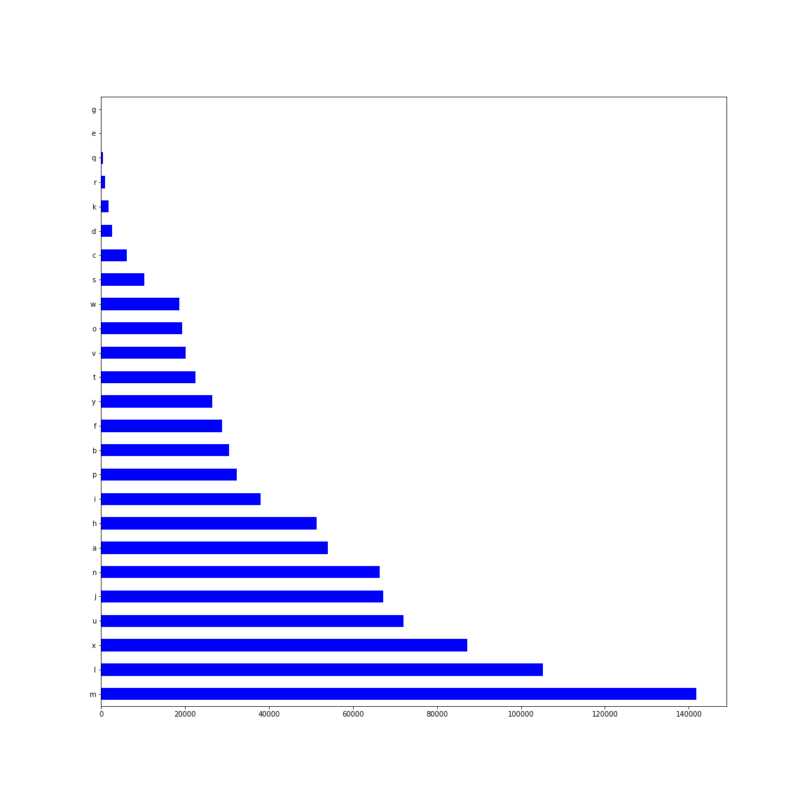

# Venturas_task

Data distribution and prediction

## Activity Contribution

I have observed that there are about 904772 activities with 139556 unique customers in activity.csv and in the other hand there are 4356 unique customers who closed their deals in 187 unique dates.



The plot is showing the activity types distribution which are not similarly distributed

### Merge both csv files

1. At first I have set a new column with target.csv with label 1 as the closed deals
2. Next I merged target.csv with activity.csv with and which matched with target.csv's both columns only their label set to 1 and others 0.<br/>
   **_label -- count_**<br/>
   **_0.0 -- 891078_**<br/>
   **_1.0 -- 13694_**<br/><br/>

**Data Distribution**<br/>

| activity_type |   a   |   b   |  c   |  d   |  e  |   f   |  g  |   h   |   i   |   j   |  k   |   l    |   m    |   n   |   o   |   p   |  q  |  r   |   s   |   t   |   u   |   v   |   w   |   x   |   y   |
| :-----------: | :---: | :---: | :--: | :--: | :-: | :---: | :-: | :---: | :---: | :---: | :--: | :----: | :----: | :---: | :---: | :---: | :-: | :--: | :---: | :---: | :---: | :---: | :---: | :---: | :---: |
|      0.0      | 53642 | 30435 | 6090 | 2723 | 71  | 28804 | 48  | 51120 | 37175 | 66950 | 1889 | 101291 | 139151 | 64634 | 19231 | 31570 | 490 | 1012 | 10248 | 22278 | 71812 | 19592 | 18297 | 86787 | 25738 |
|      1.0      |  383  |  18   |  25  |  5   |  0  |   0   |  0  |  235  |  883  |  223  |  2   |  4016  |  2675  | 1735  |  87   |  748  |  0  |  20  |  65   |  197  |  258  |  519  |  394  |  423  |  783  |

As you can see data distribution for each activity is very bad
and that's why I tried two way,

1. Majority data downsampling(label 0 data)
2. Minority data upsampling(label 1 data)

A. Majority Data Downsampling:

| activity_type |  a  |  b  |  c  |  d  |  e  |  f  |  g  |  h  |  i  |  j   |  k  |  l   |  m   |  n   |  o  |  p  |  q  |  r  |  s  |  t  |  u   |  v  |  w  |  x   |  y  |
| :-----------: | :-: | :-: | :-: | :-: | :-: | :-: | :-: | :-: | :-: | :--: | :-: | :--: | :--: | :--: | :-: | :-: | :-: | :-: | :-: | :-: | :--: | :-: | :-: | :--: | :-: |
|      0.0      | 797 | 484 | 92  | 37  |  1  | 455 |  0  | 761 | 539 | 1077 | 22  | 1607 | 2129 | 1010 | 316 | 459 |  6  | 15  | 155 | 317 | 1140 | 285 | 268 | 1348 | 374 |
|      1.0      | 383 | 18  | 25  |  5  |  0  |  0  |  0  | 235 | 883 | 223  |  2  | 4016 | 2675 | 1735 | 87  | 748 |  0  | 20  | 65  | 197 | 258  | 519 | 394 | 423  | 783 |

B. Minority Data Upsampling:

| activity_type |   a   |   b   |  c   |  d   |  e  |   f   |  g  |   h   |   i   |   j   |  k   |   l    |   m    |   n    |   o   |   p   |  q  |  r   |   s   |   t   |   u   |   v   |   w   |   x   |   y   |
| :-----------: | :---: | :---: | :--: | :--: | :-: | :---: | :-: | :---: | :---: | :---: | :--: | :----: | :----: | :----: | :---: | :---: | :-: | :--: | :---: | :---: | :---: | :---: | :---: | :---: | :---: |
|      0.0      | 53642 | 30435 | 6090 | 2723 | 71  | 28804 | 48  | 51120 | 37175 | 66950 | 1889 | 101291 | 139151 | 64634  | 19231 | 31570 | 490 | 1012 | 10248 | 22278 | 71812 | 19592 | 18297 | 86787 | 25738 |
|      1.0      | 25004 | 1159  | 1644 | 332  |  0  |   0   |  0  | 15493 | 57750 | 14370 | 127  | 261384 | 173931 | 112817 | 5603  | 48696 |  0  | 1321 | 4206  | 12989 | 16826 | 33734 | 25298 | 27560 | 50834 |

**_NOTE:_** Either downsample or upsample everytime I got label 1.0 data more than label 0.0 for some activity\*type which are **_['i', 'l', 'm', 'n', 'p', 'r', 'v', 'w', 'y']_** and for these activity_types my observation is their contribution for closing deals is 1 amoung other acticity_types.

```
On the basis of my observation, I made my [algorithm](https://github.com/sameerhashmi36/Venturas_task/blob/main/venturas_activity_check.py) and also created the [csv](https://github.com/sameerhashmi36/Venturas_task/tree/main/csv_file) which you can see in venturas_activity_check.py and activities.csv file
```

## Run Code

1. At first create a python environment

```
conda create --name environment_name python=3.7
```

2. Install the [requirments.txt](https://github.com/sameerhashmi36/Venturas_task/blob/assignment/requirements.txt) file

```
pip install -r requirements.txt
```

3. run the activity checking code in terminal([Source code](https://github.com/sameerhashmi36/Venturas_task/blob/assignment/venturas_activity_check.py))

```
python venturas_activity_check.py
```

4. run the prediction codes([Downsampled](https://github.com/sameerhashmi36/Venturas_task/blob/assignment/venturas_downsampled.py))

```
python venturas_downsampled.py
```

5. run the prediction codes([Upsampled](https://github.com/sameerhashmi36/Venturas_task/blob/assignment/venturas_upsampled.py))

```
python venturas_upsampled.py
```

## ipynb files

**I have also pushed google colab files where I did the rough. files are [venturas.ipynb](https://github.com/sameerhashmi36/Venturas_task/blob/assignment/venturas.ipynb) and [venturas_activity_check.ipynb](https://github.com/sameerhashmi36/Venturas_task/blob/assignment/venturas_activity_check.ipynb)**

## Prediction

For the prediction document part I have added a [Prediction.pdf](https://github.com/sameerhashmi36/Venturas_task/blob/assignment/Prediction.pdf) file
